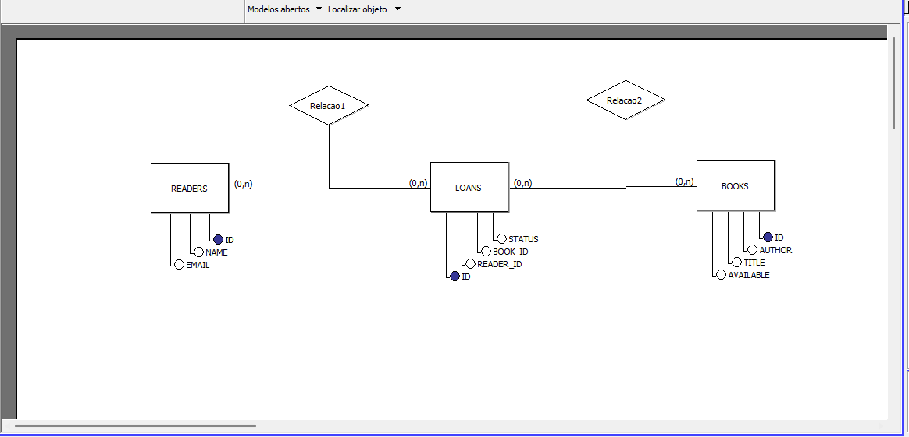

# 📚 Sistema de Gerenciamento de Biblioteca JAVA


Sistema de gerenciamento de biblioteca desenvolvido em **Java puro**, utilizando **JDBC** para persistência de dados, **Flyway** para versionamento de schema, **MySQL** rodando em **Docker**, e uma interface de linha de comando (CLI) para interação com o usuário.

O projeto foi construído com foco em **arquitetura em camadas**, **testes de integração** e **boas práticas de design**, sem o uso de frameworks como Spring — todas as decisões de persistência, injeção de dependência e tratamento de exceções foram implementadas manualmente.

---

## 🚀 Funcionalidades

- **Gestão de Leitores**: cadastro, busca por ID/email, listagem, atualização e remoção
- **Gestão de Livros**: cadastro, busca por ID/ISBN, listagem, atualização e remoção
- **Gestão de Empréstimos**: criação, busca por ID/status, listagem e devolução
- Validações de negócio (email/ISBN duplicados, entidades inexistentes, transições de status inválidas)
- Interface via terminal (CLI) organizada por menus

---

## 🛠️ Tecnologias

| Tecnologia | Uso |
|---|---|
| **Java 21** | Linguagem principal |
| **JDBC** | Persistência de dados (sem ORM) |
| **MySQL 8.4** | Banco de dados relacional |
| **Docker / Docker Compose** | Ambiente do banco de dados |
| **Flyway** | Versionamento e migração de schema |
| **Maven** | Gerenciamento de dependências e build |
| **JUnit 5** | Testes de integração |

---

## 🏗️ Arquitetura

O projeto segue uma separação em camadas, isolando responsabilidades:

```
┌─────────────────────────────────────┐
│              CLI (Menu)              │  ← Interação com o usuário
├─────────────────────────────────────┤
│              Service                 │  ← Regras de negócio
├─────────────────────────────────────┤
│             Repository               │  ← Acesso a dados (JDBC)
├─────────────────────────────────────┤
│               Domain                 │  ← Entidades e invariantes
└─────────────────────────────────────┘
```

- **Domain**: entidades (`Book`, `Reader`, `Loan`) responsáveis por proteger suas próprias invariantes (ex: um `Reader` não pode ser criado com email em formato inválido)
- **Repository**: interfaces + implementações JDBC, responsáveis exclusivamente por executar SQL e traduzir `ResultSet` em objetos de domínio
- **Service**: orquestra regras de negócio (ex: impedir emails/ISBNs duplicados, impedir devolução dupla de um empréstimo), mantendo o repository livre de lógica além da persistência
- **CLI**: camada de apresentação, responsável por capturar entrada do usuário e exibir resultados, sem conter regra de negócio

Essa divisão foi pensada para que a camada de persistência (JDBC) possa futuramente ser trocada (ex: por JPA/Hibernate) sem impactar as regras de negócio, e para que a camada de apresentação (CLI) possa ser substituída por uma API REST (Spring Boot) reaproveitando toda a lógica de `service` já implementada.

---

## 📁 Estrutura do projeto

```
src/main/java/com/davi/library/
├── domain/
│   ├── Book.java
│   ├── Reader.java
│   ├── Loan.java
│   └── LoanStatus.java
├── repository/
│   ├── BookRepository.java (interface)
│   ├── ReaderRepository.java (interface)
│   ├── LoanRepository.java (interface)
│   ├── JdbcBookRepository.java
│   ├── JdbcReaderRepository.java
│   └── JdbcLoanRepository.java
├── service/
│   ├── BookService.java
│   ├── ReaderService.java
│   └── LoanService.java
├── exception/
│   ├── DataAccessException.java
│   ├── BookNotFoundException.java
│   ├── ReaderNotFoundException.java
│   ├── LoanNotFoundException.java
│   ├── DuplicateIsbnException.java
│   └── DuplicateEmailException.java
├── connection/
│   └── ConnectionFactory.java
└── cli/
    ├── Main.java
    ├── ReaderMenu.java
    ├── BookMenu.java
    └── LoanMenu.java

src/main/resources/db/migration/
├── V1__create_books_table.sql
├── V2__create_readers_table.sql
└── V3__create_loans_table.sql

src/test/java/com/davi/library/
├── repository/
│   ├── JdbcBookRepositoryIntegrationTest.java
│   ├── JdbcReaderRepositoryIntegrationTest.java
│   └── JdbcLoanRepositoryIntegrationTest.java
└── service/
    ├── BookServiceTest.java
    ├── ReaderServiceTest.java
    └── LoanServiceTest.java
```

---

## 🗃️ Modelo de dados



- `loans.book_id` → FK para `books.id`
- `loans.reader_id` → FK para `readers.id`
- `status` (em `loans`) aceita os valores `ACTIVE` ou `RETURNED`

---

## ✅ Regras de negócio implementadas

- Um leitor não pode ser cadastrado com um email já existente
- Um livro não pode ser cadastrado com um ISBN já existente
- Atualizações de leitor/livro permitem manter o próprio email/ISBN, mas bloqueiam duplicidade com outro registro
- Um empréstimo só pode ser criado referenciando um livro e um leitor existentes
- Um empréstimo já devolvido (`RETURNED`) não pode ser devolvido novamente
- Buscas por ID (leitor, livro, empréstimo) lançam exceções específicas quando o registro não existe; buscas por email/ISBN retornam um resultado opcional (`Optional`), já que a ausência é um resultado válido, não um erro

---

## 🧪 Testes

O projeto conta com testes de integração cobrindo tanto a camada de `repository` (queries JDBC reais contra o banco) quanto a camada de `service` (regras de negócio).

Rodar todos os testes:

```bash
mvn test
```

Rodar uma classe específica:

```bash
mvn -Dtest=NomeDaClasseTest test
```

Rodar um método específico:

```bash
mvn -Dtest=NomeDaClasseTest#nomeDoMetodo test
```

---

## ⚙️ Como rodar o projeto

### Pré-requisitos

- Java 21+
- Maven
- Docker e Docker Compose

### 1. Subir o banco de dados

```bash
docker compose up -d
```

Isso sobe um container MySQL na porta `3307`, com o banco `library_db` já criado.

### 2. Definir variáveis de ambiente

O projeto lê as credenciais do banco via variáveis de ambiente:

| Variável | Padrão | Descrição |
|---|---|---|
| `DB_URL` | `jdbc:mysql://localhost:3307/library_db` | URL de conexão |
| `DB_USER` | `root` | Usuário do banco |
| `DB_PASSWORD` | *(obrigatório)* | Senha do banco |

No PowerShell:

```powershell
$env:DB_PASSWORD="sua_senha"
```

No Linux/Mac:

```bash
export DB_PASSWORD="sua_senha"
```

> Se estiver rodando pela IDE, configure as variáveis de ambiente na Run Configuration da classe `Main`.

### 3. Rodar as migrations do Flyway

```bash
mvn flyway:migrate -Dflyway.url=jdbc:mysql://localhost:3307/library_db -Dflyway.user=root -Dflyway.password=sua_senha
```

### 4. Rodar a aplicação

Pela IDE: execute o método `main` da classe `com.davi.library.cli.Main`.

---

## 📝 Exemplo de uso

```
=== Sistema de Biblioteca ===
1. Menu Leitores
2. Menu Livros
3. Menu Empréstimos
0. Sair
Escolha: 1

--- Menu Leitores ---
1. Cadastrar leitor
...
Escolha: 1
Nome: Maria
Email: maria@gmail.com
Leitor criado! ID: 1
```

---

## 🔮 Possíveis evoluções

- Migração da camada CLI para uma API REST com Spring Boot (introduzindo DTOs e Controllers)
- Regra de negócio impedindo empréstimo de um livro já emprestado
- Status adicionais para empréstimo (ex: `OVERDUE`, `CANCELLED`)
- Migração de `ConnectionFactory` manual para um pool de conexões (ex: HikariCP)

---

## 👤 Autor

Desenvolvido por **Davi** como projeto de portfólio, com foco no aprendizado de JDBC puro, arquitetura em camadas e boas práticas de persistência de dados sem uso de frameworks ORM.